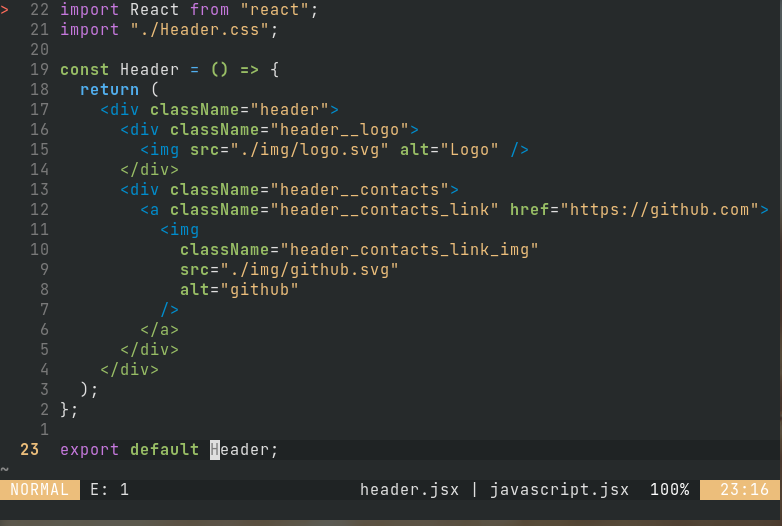

<h1 align="center">nten16.vim</h1>


------------------- 

### Install
```vim
" with vim-plug
Plug 'Smirnov-O/nten16.vim'

" Set colorscheme
set termguicolors
colorscheme nten16

" Lightline
let g:lightline = {
\ 'colorscheme': 'nten16'
\ }
```
